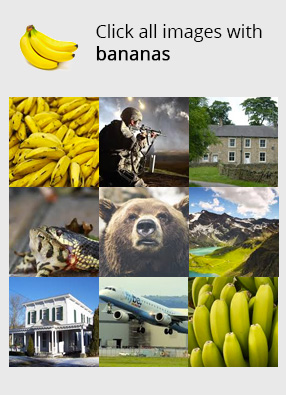
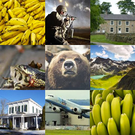

Developed by [Infosimples](https://infosimples.com), a brazilian company that
offers [data extraction solutions](https://infosimples.com/en/data-engineering).

We suggest you to also check [2Captcha.com](http://2captcha.com/?from=1025109)
for a cheaper service. You can find it's gem fully compatible with the
deathbycaptcha gem at https://github.com/infosimples/two_captcha.

[Contact us](https://infosimples.com/en) if you need enterprise services for
CAPTCHAs solving or Internet automation.


# DeathByCaptcha

DeathByCaptcha is a Ruby API for DeathByCaptcha - http://www.deathbycaptcha.com.


## Installation

Add this line to your application's Gemfile:

```ruby
gem 'deathbycaptcha', '~> 5.0.0'
```

And then execute:

    $ bundle

Or install it yourself as:

    $ gem install deathbycaptcha

## Usage

1. **Create a client**

  ```ruby
  # Create a client (:socket and :http clients are available)
  client = DeathByCaptcha.new('myusername', 'mypassword', :http)
  ```

2. **Solve a captcha**

  There are two methods available: **decode** and **decode!**
    * **decode** doesn't raise exceptions.
    * **decode!** may raise a *DeathByCaptcha::Error* if something goes wrong.

  If the solution is not available, an empty captcha object will be returned.

  ```ruby
  captcha = client.decode!(url: 'http://bit.ly/1xXZcKo')
  captcha.text        # Solution of the captcha
  captcha.id          # Numeric ID of the captcha solved by DeathByCaptcha
  captcha.is_correct  # true if the solution is correct
  ```

  You can also specify *path*, *file*, *raw* and *raw64* when decoding an image.

  ```ruby
  client.decode!(path: 'path/to/my/captcha/file')

  client.decode!(file: File.open('path/to/my/captcha/file', 'rb'))

  client.decode!(raw: File.open('path/to/my/captcha/file', 'rb').read)

  client.decode!(raw64: Base64.encode64(File.open('path/to/my/captcha/file', 'rb').read))
  ```

  > Internally, the gem will always convert any image to raw64 (binary base64
  encoded).

3. **Retrieve a previously solved captcha**

  ```ruby
  captcha = client.captcha('130920620') # with 130920620 as the captcha id
  ```

4. **Report incorrectly solved captcha for refund**

  ```ruby
  captcha = client.report!('130920620') # with 130920620 as the captcha id
  ```

  > ***Warning:*** *do not abuse on this method, otherwise you may get banned*

5. **Retrieve your user information (which has the current credit balance)**

  ```ruby
  user = client.user()
  user.is_banned  # true if the user is banned
  user.balance    # Credit balance in US cents
  user.rate       # Captcha rate, i.e. charges for one solved captcha in US cents
  user.id         # Numeric ID of your account
  ```

6. **Retrieve DeathByCaptcha server status**

  ```ruby
  status = client.status()
  status.todays_accuracy        # Current accuracy of DeathByCaptcha
  status.solved_in              # Estimated seconds to solve a captcha right now
  status.is_service_overloaded  # true if DeathByCaptcha is overloaded/unresponsive
  ```

## New reCAPTCHA

> It's currently available only with the :http client.

To solve captchas similar to
[reCAPTCHA v2](https://support.google.com/recaptcha/?hl=en#6262736), you can use
both the DeathByCaptcha's **Coordinates API** or **Image Group API**.

Please, read the oficial documentation at
http://www.deathbycaptcha.com/user/api/newrecaptcha.

### Using the Coordinates API

```ruby
# Read above all the instructions on how to solve a captcha.
captcha = client.decode!(type: 2, url: 'http://bit.ly/1VCUuzk')
```

You should specify arguments with *type = 2* and an image similar to a screenshot of
the captcha. See an example:

**Captcha (screenshot)**

> the argument is passed as *url*, *path*, *file*, *raw* or *raw64*



The response will be an array containing coordinates (x, y) where the human
clicked to solve the captcha. For the captcha above it should look something
like:

```ruby
# captcha.text
"[[30,143],[241,325]]"

# captcha.coordinates
[[30, 143], [241, 325]]
```

### Using the Image Group API

```ruby
# Read above all the instructions on how to solve a captcha.
captcha = client.decode!(
  type: 3,
  url: 'http://bit.ly/1i1CIaB', # single image with the clickable grid
  banner: { url: 'http://bit.ly/1JTG4T3' }, # the banner image
  banner_text: 'Click all images with bananas' # the banner text
)
```

You should specify arguments with *type = 3* and the decomposed captcha as seen in the
example below:

**Captcha: images grid**

> the argument is passed as *url*, *path*, *file*, *raw* or *raw64*



**Captcha: banner**


**Captcha: banner text**

> Click all images with bananas

The response will be an array containing the indexes for each image that should
be clicked counting from left to right. For the captcha above it should look
something like:

```ruby
# captcha.text
"[1,9]"

# captcha.indexes
[1, 9]
```

## Notes

#### Thread-safety

The API is thread-safe, which means it is perfectly fine to share a client
instance between multiple threads.

#### HTTP and Socket clients

The API supports HTTP and socket-based connections, with the latter being
recommended for having faster responses and overall better performance. The two
clients have the same methods/interface.

When using the socket client, make sure that outgoing TCP traffic to
**api.dbcapi.me** to the ports in range **8123-8130** is not blocked by your
firewall.

> We are currently suggesting developers to use HTTP connection because Socket
> seems to be unstable with older Ruby versions. While we are investigating,
> consider using only HTTP connection.

#### Ruby dependencies

DeathByCaptcha >= 5.0.0 don't require specific dependencies. That saves you
memory and avoid conflicts with other gems.

#### Input image format

Any format you use in the decode method (url, file, path, raw, raw64) will
always be converted to a raw64, which is a binary base64 encoded string. So, if
you already have this format available on your side, there's no need to do
convertions before calling the API.

> Our recomendation is to never convert your image format, unless needed. Let
> the gem convert internally. It may save you resources (CPU, memory and IO).

#### Versioning

We no longer follow the versioninig system of the official clients of
DeathByCaptcha. We have bumped to version 5.0.0 and will use
[Semantic Versioning](http://semver.org/) from now on.

#### Upgrade from 4.x to 5.x

Any 5.x version is incompatible with any 4.x version. Please, review your code
before upgrading.

#### Ruby versions

This gem has been tested on the following versions of Ruby:

* MRI 2.2.0
* MRI 2.1.5
* MRI 2.0.0
* MRI 1.9.3

# Maintainers

* [Débora Setton Fernandes](http://github.com/deborasetton)
* [Marcelo Mita](http://github.com/marcelomita)
* [Rafael Barbolo](http://github.com/barbolo)
* [Rafael Ivan Garcia](http://github.com/rafaelivan)


## Contributing

1. Fork it ( https://github.com/infosimples/deathbycaptcha/fork )
2. Create your feature branch (`git checkout -b my-new-feature`)
3. **Run/add tests (RSpec)**
4. Commit your changes (`git commit -am 'Add some feature'`)
5. Push to the branch (`git push origin my-new-feature`)
6. Create a new Pull Request
7. Yay. Thanks for contributing :)

All contributors:
https://github.com/infosimples/deathbycaptcha/graphs/contributors


# License

MIT License. Copyright (C) 2011-2015 Infosimples. https://infosimples.com/
